# Workshop Booking - FOSSEE UI/UX Enhancement

## Project Overview

I worked on improving the frontend experience of the existing Django project without changing the backend flow. The focus was on cleaner UI, better mobile usability, better accessibility, basic SEO improvements, and small React-based interactions where they actually help.

## Key Improvements

- Cleaned up the main layout and navigation so important actions are easier to find.
- Updated auth, profile, dashboard, and workshop pages with consistent spacing and form patterns.
- Improved visual hierarchy on key pages like statistics and dashboards.
- Reduced UI clutter and made action buttons more obvious.
- Kept the original booking workflow intact.

## Design Principles

I followed three simple principles:

- **Clarity:** important actions should be obvious.
- **Consistency:** similar pages should look and behave similarly.
- **Usability:** common tasks should need fewer clicks and less scrolling.

## Responsiveness

- Built with a mobile-first mindset, since most students use phones.
- Used responsive grid/card layouts and page-specific media queries.
- Improved spacing and control sizing for touch use.
- Kept wide tables inside horizontal wrappers so small screens stay usable.

## Performance Trade-offs

- Avoided adding heavy new UI libraries.
- Kept React usage limited to interactive chart controls instead of converting the app to a full SPA.
- Continued using server-rendered Django templates for most pages to keep load time and complexity low.

## Challenges

The hardest part was working with legacy templates while keeping existing behavior safe. Cleaning up older inline interactions and improving page structure without affecting backend flows took careful, page-by-page changes.

## React Usage

React is used only in statistics pages for chart interaction controls:

- `statistics_app/templates/statistics_app/workshop_public_stats.html`
- `statistics_app/templates/statistics_app/team_stats.html`

This kept React meaningful and scoped to UI interactions where stateful controls are useful.

## Accessibility

- Improved form labeling and structure across key pages.
- Added/kept stronger keyboard focus visibility in shared styles.
- Improved heading structure and semantic layout in updated templates.
- Reduced inline click handling and moved behavior toward script files where possible.

## SEO

- Added reusable meta blocks in the main base template.
- Included canonical, Open Graph, and Twitter metadata support.
- Improved semantic HTML usage on major pages.

## Visual Comparison (Before vs After)

Total screenshots: **14**

### Desktop

| Before | After |
|---|---|
| 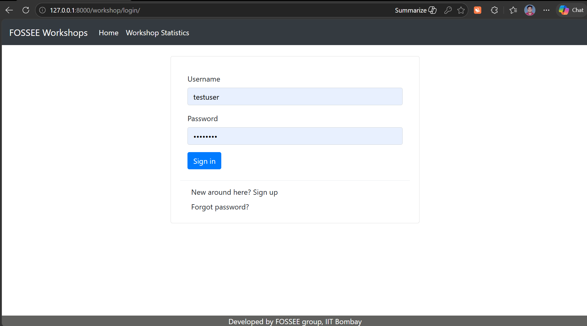 | 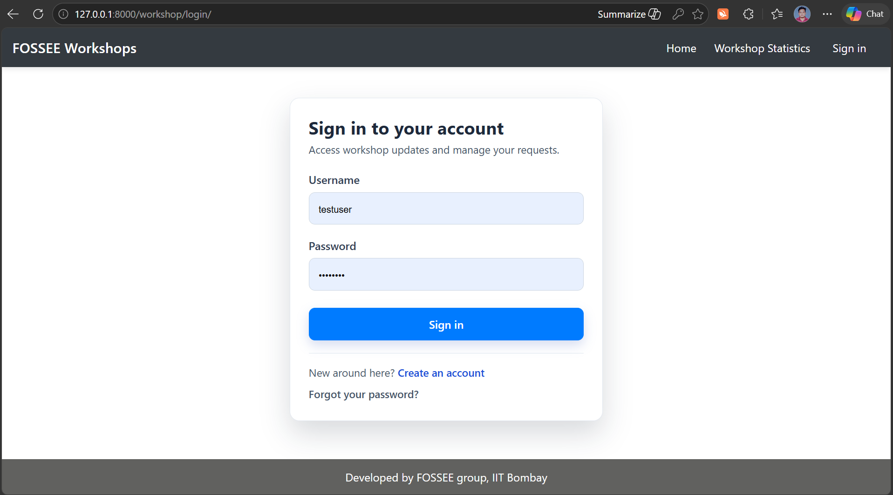 |
| 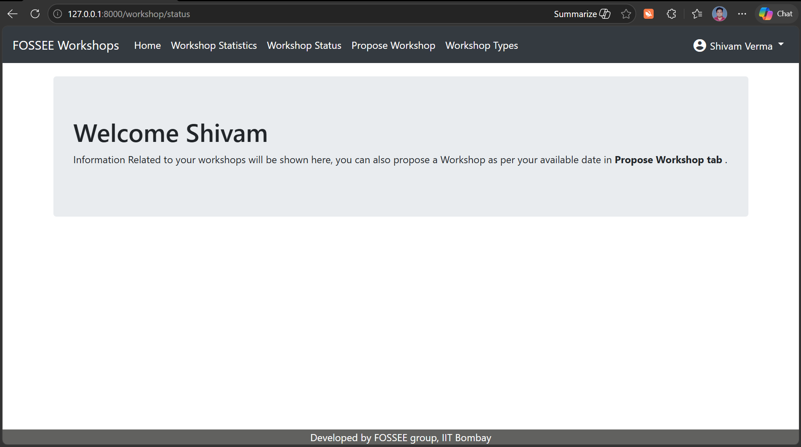 | 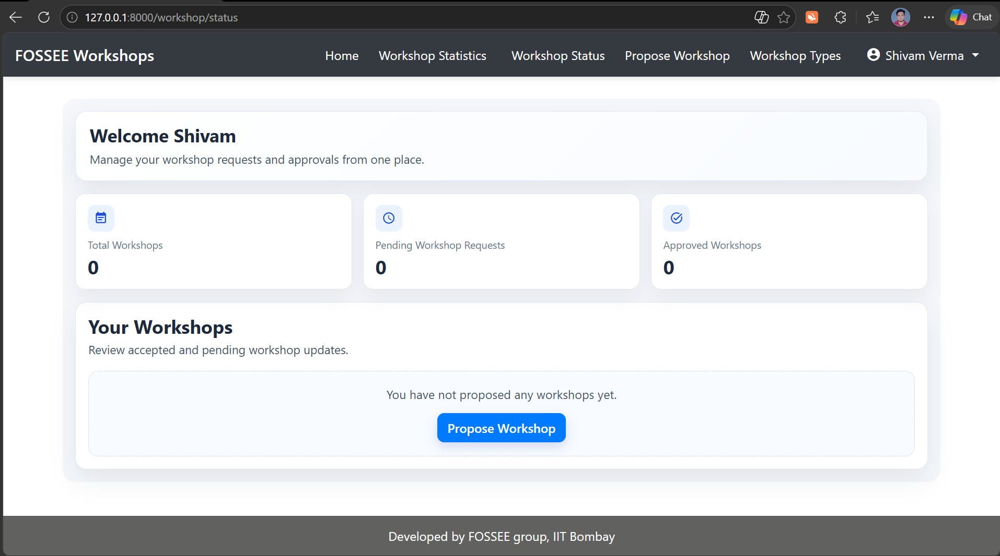 |
| 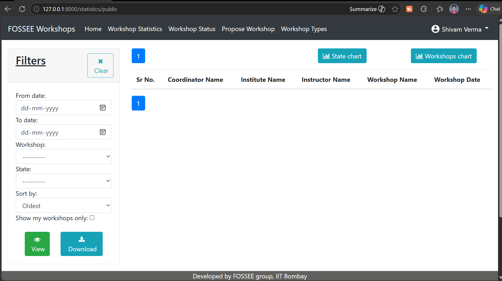 | 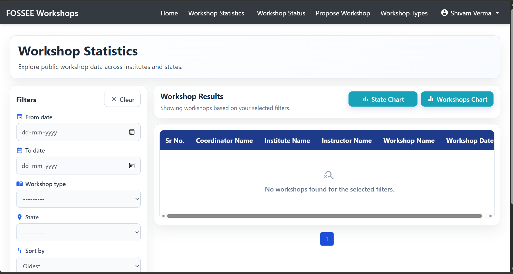 |

### Mobile

| Before | After |
|---|---|
| 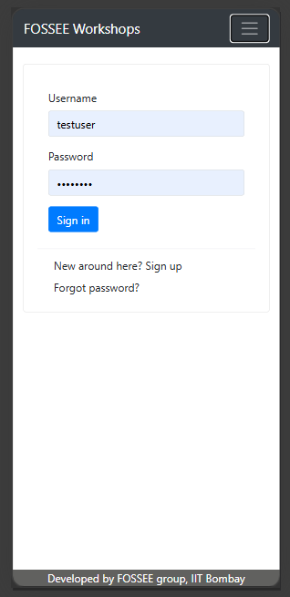 | 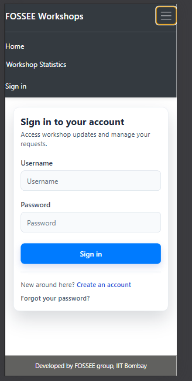 |
| 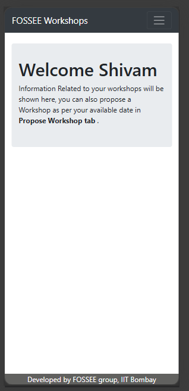 | 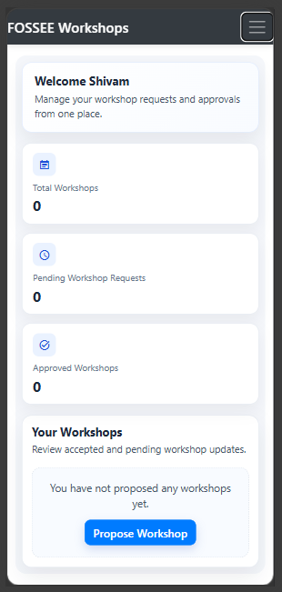 |
| 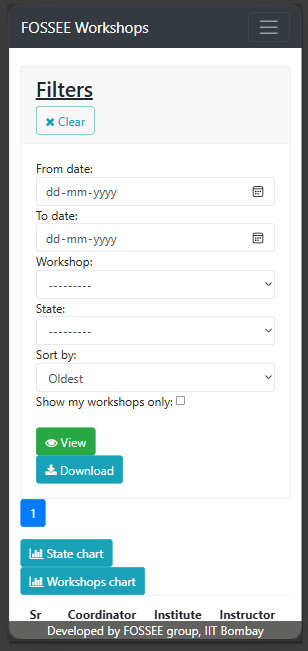 | 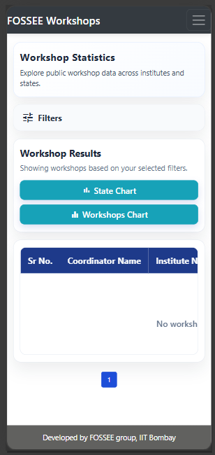 |
| 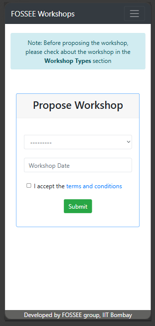 | 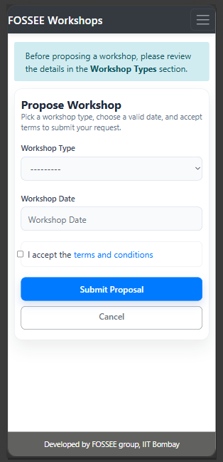 |

## Demo Video

These clips show the main workflow, including dashboard flow, public stats interaction, and mobile behavior.

- Desktop Before: [docs/videos/desktop_before.mp4](docs/videos/desktop_before.mp4)
- Desktop After: [docs/videos/desktop_after.mp4](docs/videos/desktop_after.mp4)
- Mobile Before: [docs/videos/mobile_before.mp4](docs/videos/mobile_before.mp4)
- Mobile After: [docs/videos/mobile_after.mp4](docs/videos/mobile_after.mp4)

## Setup Instructions

**Tested on Python 3.10 for Django compatibility.**

1. Clone the repository.

```bash
git clone https://github.com/FOSSEE/workshop_booking.git
cd workshop_booking
```

2. Create and activate a virtual environment (Python 3.10).

```bash
python -m venv .venv
```

Windows PowerShell:

```powershell
.\.venv\Scripts\Activate.ps1
```

3. Install dependencies.

```bash
pip install -r requirements.txt
```

4. Configure `local_settings.py` (email placeholders).

5. Run migrations.

```bash
python manage.py makemigrations
python manage.py migrate
```

6. Start server.

```bash
python manage.py runserver
```

Open: `http://127.0.0.1:8000/`

## Final Note

I focused on practical usability improvements and responsive behavior while keeping the original backend workflow stable.# **Workshop Booking**
